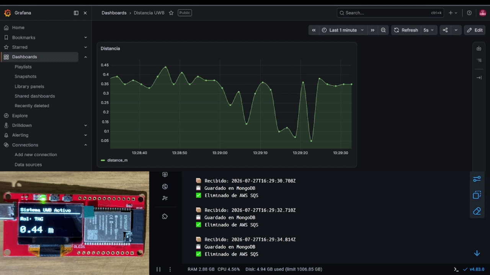
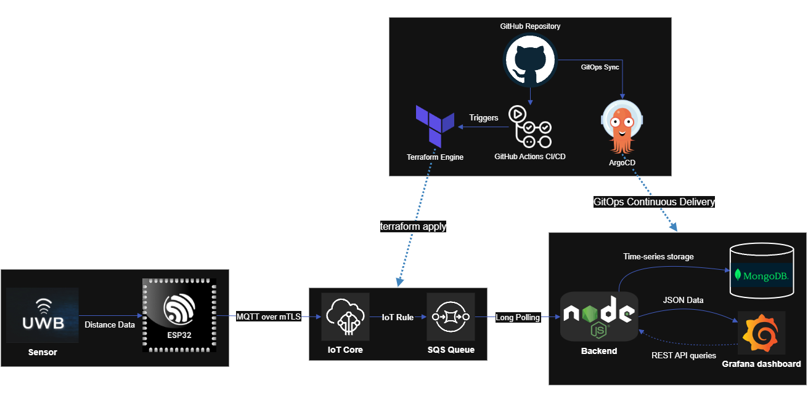

<div align="right">
  🌎 <a href="README-en.md">English</a> | 🇪🇸 <a href="README.md">Español</a>
</div>

# 🌐 Enterprise IoT Provisioning & Telemetry Pipeline

End-to-end Cloud Native IoT telemetry pipeline: ESP32 to AWS (JITP), orchestrated both with Docker and native Kubernetes using ArgoCD (GitOps), with automated cloud infrastructure via Terraform (IaC) and CI/CD via GitHub Actions.
The firmware is built with modularity in mind, featuring concurrent tasks for UWB distance measurement, BLE provisioning/diagnostics, and AWS IoT MQTT communication, managed via RTOS.


> **🔒 Security Note:** Sensitive data such as AWS IAM credentials, Wi-Fi passwords, and X.509 cryptographic certificates have been removed from this repository. Please refer to the `.env.example` (backend) and `config.example.h` (firmware) files to configure your own environment.

## 📋 Overview

An end-to-end Cloud Native architecture designed for Ultra-Wideband (UWB) sensor telemetry. This project bridges physical hardware at the edge with Serverless cloud infrastructure, demonstrating a complete data lifecycle from secure device provisioning to real-time observability.

### 🎥 Live Demonstration



**The Data Lifecycle in Action:**

- 📍 **Edge (Bottom Left):** ESP32 UWB Pro hardware displaying raw distance measurements locally.
- ⚙️ **Backend (Bottom Right):** Containerized Node.js microservice pulling messages from AWS SQS, persisting them to MongoDB, and acknowledging/deleting them from the queue.
- 📊 **Observability (Top):** Grafana dashboard instantly reflecting physical distance variations.

_(Real-time telemetry stream handled via custom cache-busting REST API)_

---

## 🏗️ Architecture & Data Flow



The pipeline is structured into five distinct layers:

1. **Edge & Security (Hardware):**
   - **ESP32** capturing UWB sensor data.
   - Secure device registration via **Zero-Touch Provisioning (JITP)** on AWS IoT Core.
   - Hardware-level security: Persistent storage of X.509 cryptographic certificates and private keys in secure memory partitions (**NVS**).
2. **Cloud Ingestion (AWS Serverless):**
   - Asynchronous MQTT message routing using **AWS IoT Rules**.
   - Decoupling and message queuing via **AWS SQS** for reliable backend processing.
   - Fault tolerance & resilience: **Dead Letter Queue (DLQ)** with automatic redrive policy.
3. **Backend & Persistence:**
   - Dual deployment support: lightweight local development with **Docker Compose** or Cloud-Native architecture on **Kubernetes**.
   - Containerized **Node.js** microservice acting as an SQS consumer using long-polling with _Liveness_ and _Readiness_ probes.
   - Time-series data formatting stored in **MongoDB** configured as a `StatefulSet` on Kubernetes with Persistent Volume Claims (`PVC`).
4. **Observability (Frontend):**
   - **Grafana** dashboard containerized alongside the backend (accessible via `NodePort` on Kubernetes or port 3000 on Docker).
   - Consumes data via a Custom JSON REST API with tailored `cache-busting` parameters (`?cb=${__to}`) to ensure zero-latency live data streaming.
5. **Infrastructure as Code (IaC) & GitOps:**
   - Declarative cloud provisioning on AWS with **Terraform** and encrypted remote state (**AWS S3** + **DynamoDB State Locking**).
   - Automated CI/CD pipeline via **GitHub Actions**: predictive `terraform plan` comments on Pull Requests and automatic `terraform apply` on merge to `main`.
   - Continuous Delivery / GitOps via **ArgoCD**: declarative microservices orchestration using **Kustomize** continuously reconciled from GitHub with automated _Self-Healing_.

---

## 🗂️ Monorepo Structure

This project uses a monorepo approach to separate concerns while keeping the full pipeline in one place:

- `/.github`: CI/CD automation with GitHub Actions for Terraform validation and GitOps deployments.
- `/firmware`: PlatformIO project containing the C++ code for the ESP32.
- `/backend`: Node.js microservice, Grafana provisioning, and Docker Compose configurations.
- `/terraform`: Infrastructure as Code (IaC) in HCL automating AWS SQS queues, Dead Letter Queues (DLQ), AWS IoT Core rules, and Least Privilege IAM policies.

---

## ☁️ Cloud Infrastructure Deployment (Terraform)

All required AWS cloud infrastructure can be provisioned in seconds using Terraform:

1. **Prerequisites:**
   - [Terraform](https://developer.hashicorp.com/terraform/install) (>= 1.5.0).
   - AWS credentials configured in your environment (`AWS_ACCESS_KEY_ID`, `AWS_SECRET_ACCESS_KEY`, `AWS_REGION`).

2. **Initialize and Deploy:**

   ```bash
   cd terraform
   terraform init
   terraform plan
   terraform apply
   ```

3. **Wire with Backend and Firmware:**
   Terraform outputs the dynamic endpoints and queue URLs directly:
   - `sqs_queue_url` ➔ Set as `QUEUE_URL` in `backend/.env`.
   - `iot_endpoint` ➔ Set as `ENDPOINT` in `firmware/include/config.h`.

4. **Tear Down Infrastructure (Zero-Cost Guarantee):**
   To destroy all AWS cloud resources and avoid incurring any unwanted costs:

   ```bash
   terraform destroy
   ```

---

---

## ☸️ Option 1: Cloud-Native & GitOps Deployment (Kubernetes + ArgoCD) [Recommended]

For production and highly scalable environments, the application layer is declaratively managed with **Kubernetes** and **Kustomize**, and continuously reconciled via **ArgoCD**:

### 1. Automated Deployment with ArgoCD (GitOps)

If ArgoCD is installed in your Kubernetes cluster, simply apply the application manifest:

```bash
kubectl apply -f k8s/argocd/application.yaml
```

ArgoCD will continuously monitor this repository, deploy all microservices to the `iot-pipeline` namespace, and automatically enforce desired cluster state.

- **ArgoCD Web Console:** `https://localhost:8085` (or via `kubectl port-forward svc/argocd-server -n argocd 8085:443`).

### 2. Manual Deployment via Kustomize (Without ArgoCD)

```bash
# 1. Apply base configuration to the cluster
kubectl apply -k ./k8s/base

# 2. Verify pods, services, and PVCs
kubectl get pods,svc,pvc -n iot-pipeline

# 3. Access Grafana running in the cluster
kubectl port-forward svc/grafana-service -n iot-pipeline 3000:3000
```

---

## 🚀 Option 2: Fast Local Quickstart (Docker Compose) [Lightweight]

For rapid local developer testing without requiring an active Kubernetes cluster:

### Prerequisites

- [Docker](https://docs.docker.com/get-docker/) & Docker Compose installed.

### Setup Instructions

1. **Configure Environment Variables:**

   ```bash
   cd backend
   cp .env.example .env
   # Edit .env with your AWS IAM credentials and SQS queue URL
   ```

2. **Start the Microservices:**

   ```bash
   docker-compose up -d --build
   ```

3. **Access the Services:**
   - Grafana Dashboard: http://localhost:3000 (Default: admin / admin)
   - Node.js REST API: http://localhost:8080
   - MongoDB Instance: mongodb://localhost:27017

_Data persistence is configured via Docker volumes (/var/lib/grafana and /data/db) to ensure dashboard layouts and telemetry data survive container restarts._

---

## 🛠️ Key Technical Highlights

- **Cloud-Native Orchestration & GitOps (Kubernetes & ArgoCD):** Declarative architecture using Kustomize, stateful persistence via `StatefulSet`, container health management (`liveness/readiness probes`), and automated continuous reconciliation (_Self-Healing_).
- **Infrastructure as Code (IaC) & GitOps:** 100% automated cloud deployment using Terraform in HCL, secure remote state storage on AWS S3 with DynamoDB state locking, and an automated GitHub Actions CI/CD pipeline with predictive plan PR comments.
- **Message Resilience & Reliability:** Asynchronous decoupling via AWS SQS combined with a Dead Letter Queue (DLQ) and automatic redrive policies to isolate errors without pipeline interruption.
- **Cryptographic Security:** Strict implementation of the Principle of Least Privilege across the device lifecycle and granular IAM roles.
- **Microservices Orchestration:** Fully isolated backend components using Docker networks and volumes or native Kubernetes networking.
- **Real-time Observability:** Solved native dashboard latency by engineering a custom cache-busting API endpoint for Grafana.
