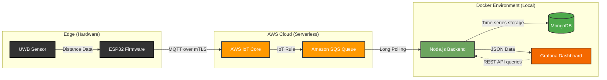

# 🌐 Enterprise IoT Provisioning & Telemetry Pipeline

End-to-end Cloud Native IoT telemetry pipeline: ESP32 to AWS (JITP), orchestrated with Node.js, MongoDB, and Grafana via Docker.
The firmware is built with modularity in mind, featuring concurrent tasks for UWB distance measurement, BLE provisioning/diagnostics, and AWS IoT MQTT communication, managed via RTOS.


> **🔒 Security Note:** Sensitive data such as AWS IAM credentials, Wi-Fi passwords, and X.509 cryptographic certificates have been removed from this repository. Please refer to the `.env.example` (backend) and `config.example.h` (firmware) files to configure your own environment.

## 📋 Overview

An end-to-end Cloud Native architecture designed for Ultra-Wideband (UWB) sensor telemetry. This project bridges physical hardware at the edge with Serverless cloud infrastructure, demonstrating a complete data lifecycle from secure device provisioning to real-time observability.

### 🎥 Live Demonstration


_(Real-time telemetry stream handled via custom cache-busting REST API)_

---

## 🏗️ Architecture & Data Flow



The pipeline is structured into four distinct layers:

1. **Edge & Security (Hardware):**
   - **ESP32** capturing UWB sensor data.
   - Secure device registration via **Zero-Touch Provisioning (JITP)** on AWS IoT Core.
   - Hardware-level security: Persistent storage of X.509 cryptographic certificates and private keys in secure memory partitions (**NVS**).
2. **Cloud Ingestion (AWS Serverless):**
   - Asynchronous MQTT message routing using **AWS IoT Rules**.
   - Decoupling and message queuing via **AWS SQS** for reliable backend processing.
3. **Backend & Persistence:**
   - Containerized **Node.js** microservice acting as an SQS consumer.
   - Time-series data formatting (ordered by `-1` limits and timestamps) stored in **MongoDB**.
4. **Observability (Frontend):**
   - **Grafana** dashboard containerized alongside the backend.
   - Consumes data via a Custom JSON REST API with tailored `cache-busting` parameters (`?cb=${__to}`) to ensure zero-latency live data streaming.

---

## 🗂️ Monorepo Structure

This project uses a monorepo approach to separate concerns while keeping the full pipeline in one place:

- `/firmware`: PlatformIO project containing the C++ code for the ESP32.
- `/backend`: Node.js microservice, Grafana provisioning, and Docker Compose configurations.

---

## 🚀 Local Deployment (Backend & Observability)

The backend and observability layers are fully containerized. You can spin up the local environment (Node.js API, MongoDB, and Grafana) using Docker.

### Prerequisites

- [Docker](https://docs.docker.com/get-docker/) & Docker Compose installed.

### Setup Instructions

1. **Clone this repository:**

   ```bash
   git clone https://github.com/Rivero-Agustin/esp32-iot-telemetry-pipeline.git
   cd esp32-iot-telemetry-pipeline

2. Configure Environment Variables:
   Navigate to the backend directory and set up your AWS credentials.

   ```bash
   cd backend
   cp .env.example .env
*Edit the .env file with your AWS IAM keys and SQS URL.*

3. Start the Microservices:

   ```bash
   docker-compose up -d --build

4. Access the Services:

- Grafana Dashboard: http://localhost:3000 (Default: admin / admin)
- Node.js REST API: http://localhost:3001
- MongoDB Instance: mongodb://localhost:27017

_Data persistence is configured via Docker volumes (/var/lib/grafana and /data/db) to ensure dashboard layouts and telemetry data survive container restarts._

## 🛠️ Key Technical Highlights

- **Cryptographic Security:** Implemented the Principle of Least Privilege across the device lifecycle.
- **Microservices Orchestration:** Fully isolated backend components using Docker networks and volumes.
- **Real-time Observability:** Solved native dashboard latency by engineering a custom cache-busting API endpoint for Grafana.
