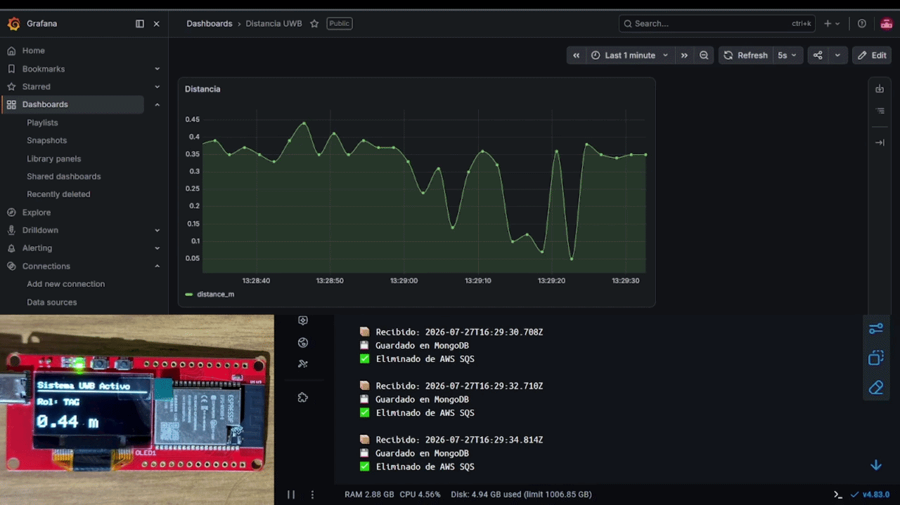
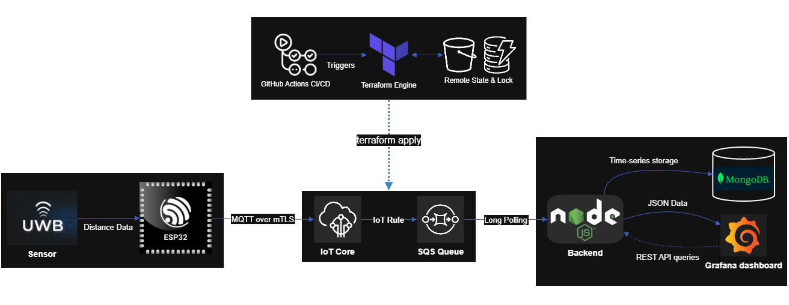

<div align="right">
  🌎 <a href="README-en.md">English</a> | 🇪🇸 <a href="README.md">Español</a>
</div>

# 🌐 Enterprise IoT Provisioning & Telemetry Pipeline

Pipeline de telemetría IoT Cloud Native de extremo a extremo: ESP32 a AWS (JITP), orquestado con Node.js, MongoDB y Grafana mediante Docker, con infraestructura automatizada mediante Terraform (IaC) y pipeline GitOps en GitHub Actions.
El firmware está diseñado teniendo en cuenta la modularidad, presentando tareas concurrentes para la medición de distancia UWB, aprovisionamiento/diagnóstico BLE y comunicación MQTT con AWS IoT, gestionado a través de RTOS.


> **🔒 Nota de Seguridad:** Los datos sensibles como credenciales de AWS IAM, contraseñas de Wi-Fi y certificados criptográficos X.509 han sido eliminados de este repositorio. Por favor, consulte los archivos `.env.example` (backend) y `config.example.h` (firmware) para configurar su propio entorno.

## 📋 Descripción General

Una arquitectura Cloud Native de extremo a extremo diseñada para la telemetría de sensores Ultra-Wideband (UWB). Este proyecto conecta el hardware físico en el Edge con infraestructura cloud Serverless, demostrando un ciclo de vida completo de datos desde el aprovisionamiento seguro del dispositivo hasta la observabilidad en tiempo real.

### 🎥 Demostración en Vivo



**El Ciclo de Vida de los Datos en Acción:**

- 📍 **Edge (Inferior Izquierda):** Hardware ESP32 UWB Pro mostrando mediciones de distancia sin procesar localmente.
- ⚙️ **Backend (Inferior Derecha):** Microservicio Node.js contenedorizado consumiendo mensajes desde AWS SQS, persistiendo los datos en MongoDB y confirmando/eliminando los mensajes de la cola.
- 📊 **Observabilidad (Superior):** Dashboard de Grafana reflejando instantáneamente las variaciones de distancia física.

_(Flujo de telemetría en tiempo real gestionado mediante una API REST personalizada con cache-busting)_

---

## 🏗️ Arquitectura y Flujo de Datos



El pipeline está estructurado en cinco capas diferenciadas:

1. **Edge y Seguridad (Hardware):**
   - **ESP32** capturando datos de sensores UWB.
   - Registro seguro de dispositivos mediante **Zero-Touch Provisioning (JITP)** en AWS IoT Core.
   - Seguridad a nivel de hardware: Almacenamiento persistente de certificados criptográficos X.509 y claves privadas en particiones de memoria segura (**NVS**).
2. **Ingesta Cloud (AWS Serverless):**
   - Enrutamiento asíncrono de mensajes MQTT utilizando **AWS IoT Rules**.
   - Desacoplamiento y encolamiento de mensajes mediante **AWS SQS** para un procesamiento fiable en el backend.
   - Resiliencia y tolerancia a fallos: **Dead Letter Queue (DLQ)** con política de reenvío automático.
3. **Backend y Persistencia:**
   - Microservicio **Node.js** contenedorizado actuando como consumidor de SQS mediante long-polling.
   - Formateo de datos de series temporales (ordenados por límites `-1` y marcas de tiempo) almacenados en **MongoDB**.
4. **Observabilidad (Frontend):**
   - Dashboard de **Grafana** contenedorizado junto con el backend.
   - Consume datos mediante una API REST JSON personalizada con parámetros adaptados de `cache-busting` (`?cb=${__to}`) para garantizar la transmisión de datos en vivo sin latencia.
5. **Infraestructura como Código (IaC) & GitOps:**
   - Despliegue declarativo y versionado de AWS con **Terraform**.
   - Gestión de estado remoto seguro con cifrado en **AWS S3** y bloqueo de concurrencia con **DynamoDB**.
   - Pipeline CI/CD en **GitHub Actions**: validación y `terraform plan` predictivo en Pull Requests, y `terraform apply` automático al fusionar a `main`.

---

## 🗂️ Estructura del Monorepo

Este proyecto utiliza un enfoque monorepo para separar responsabilidades manteniendo todo el pipeline en un solo lugar:

- `/.github`: Automatización CI/CD con GitHub Actions para validación y despliegue GitOps de Terraform.
- `/firmware`: Proyecto de PlatformIO que contiene el código C++ para el ESP32.
- `/backend`: Microservicio Node.js, aprovisionamiento de Grafana y configuraciones de Docker Compose.
- `/terraform`: Infraestructura como Código (IaC) para aprovisionar colas SQS, Dead Letter Queues (DLQ), reglas de AWS IoT Core y políticas IAM con Principio de Menor Privilegio.

---

## ☁️ Despliegue de Infraestructura Cloud (Terraform)

Toda la infraestructura requerida en AWS se despliega automáticamente en segundos utilizando Terraform:

1. **Requisitos Previos:**
   - [Terraform](https://developer.hashicorp.com/terraform/install) (>= 1.5.0).
   - Credenciales de AWS configuradas en el entorno (`AWS_ACCESS_KEY_ID`, `AWS_SECRET_ACCESS_KEY`, `AWS_REGION`).

2. **Inicializar y Desplegar:**

   ```bash
   cd terraform
   terraform init
   terraform plan
   terraform apply
   ```

3. **Conectar con Backend y Firmware:**
   Terraform generará automáticamente los endpoints y URLs necesarios:
   - `sqs_queue_url` ➔ Copiar en `QUEUE_URL` dentro de `backend/.env`.
   - `iot_endpoint` ➔ Copiar en `ENDPOINT` dentro de `firmware/include/config.h`.

4. **Destruir Recursos (Ahorro de Costos):**
   Para eliminar todos los recursos de AWS y evitar costos cuando no esté en uso:

   ```bash
   terraform destroy
   ```

---

## 🚀 Despliegue Local (Backend y Observabilidad)

Las capas de backend y observabilidad están completamente contenedorizadas. Puede iniciar el entorno local (API Node.js, MongoDB y Grafana) utilizando Docker.

### Requisitos Previos

- [Docker](https://docs.docker.com/get-docker/) y Docker Compose instalados.

### Instrucciones de Configuración

1. **Clonar este repositorio:**

   ```bash
   git clone https://github.com/Rivero-Agustin/esp32-iot-telemetry-pipeline.git
   cd esp32-iot-telemetry-pipeline
   ```

2. **Configurar las Variables de Entorno:**
   Navegue al directorio de backend y configure sus credenciales de AWS.

   ```bash
   cd backend
   cp .env.example .env
   # Edite el archivo .env con sus claves de AWS IAM y la URL de SQS.
   ```

3. **Iniciar los Microservicios:**

   ```bash
   docker-compose up -d --build
   ```

4. **Acceder a los Servicios:**

- Dashboard de Grafana: http://localhost:3000 (Predeterminado: admin / admin)
- API REST de Node.js: http://localhost:3001
- Instancia de MongoDB: mongodb://localhost:27017

_La persistencia de datos está configurada mediante volúmenes de Docker (/var/lib/grafana y /data/db) para garantizar que las configuraciones de los dashboards y los datos de telemetría persistan tras el reinicio de los contenedores._

## 🛠️ Aspectos Técnicos Destacados

- **Infraestructura como Código (IaC) & GitOps:** Despliegue cloud 100% automatizado mediante Terraform en HCL, backend remoto protegido en AWS S3 con DynamoDB state locking, y pipeline CI/CD en GitHub Actions con planes predictivos en PRs.
- **Resiliencia y Confiabilidad:** Desacoplamiento asíncrono con AWS SQS y Dead Letter Queue (DLQ) con política de reintentos para aislar errores sin interrupciones.
- **Seguridad Criptográfica:** Implementación del Principio de Menor Privilegio a lo largo de todo el ciclo de vida del dispositivo y roles IAM acotados.
- **Orquestación de Microservicios:** Componentes de backend completamente aislados utilizando redes y volúmenes de Docker.
- **Observabilidad en Tiempo Real:** Resolución de la latencia nativa del dashboard mediante la ingeniería de un endpoint API personalizado con cache-busting para Grafana.
